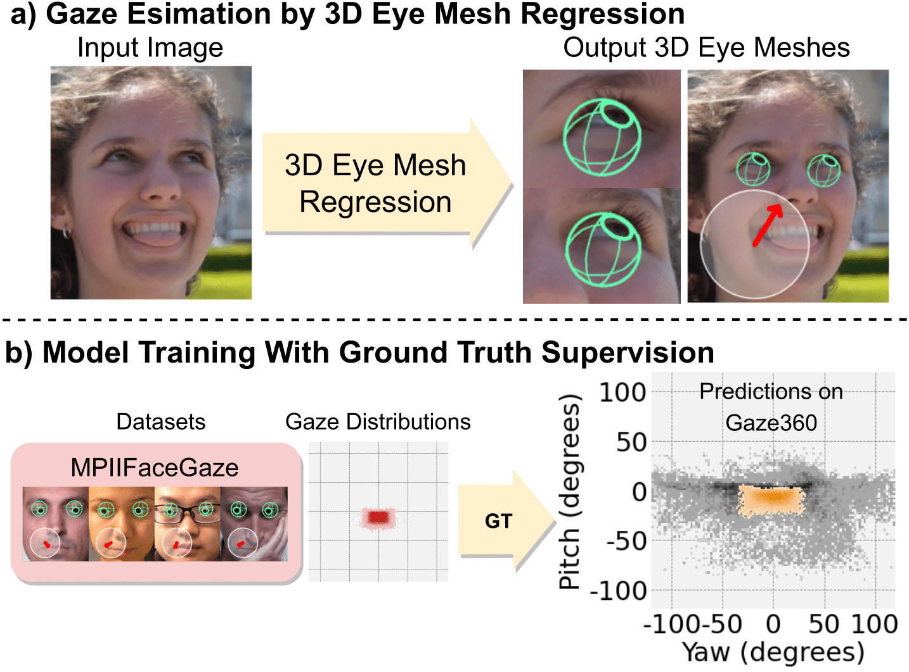
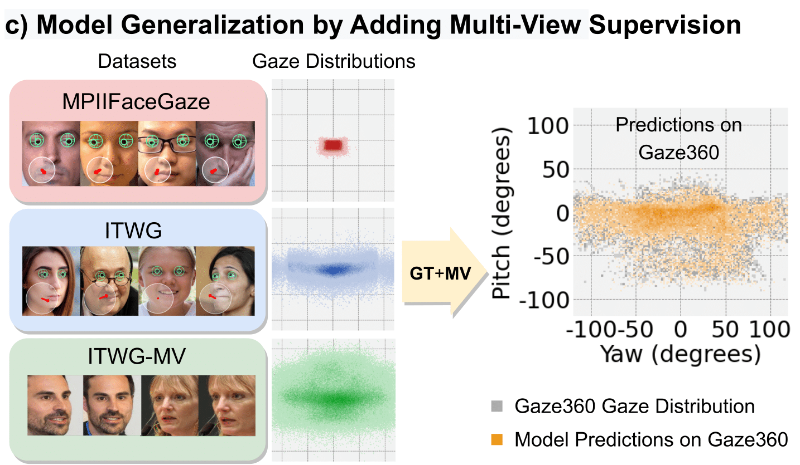

# [ECCV 2024] 3DGazeNet: Generalizing Gaze Estimation with Weak-Supervision from Synthetic Views

3DGazeNet is a general gaze estimation model which can be **directly employed in novel environments without adaptation**.
In 3DGazeNet we leverage the observation that head, body, and hand pose estimation benefit from revising them as dense 3D coordinate prediction, and similarly express gaze estimation as regression of dense 3D eye meshes. In addition, we employ a diverse set of unlabelled, in-the-wild face images to boost gaze generalization in real images and videos, by enforcing multi-view consistency constraints during training.


<p align="center">
  
  
</p>

https://github.com/Vagver/dense3Deyes/assets/25174551/4de4fb76-9577-4209-ba07-779356230131


## Demo

For a demo of 3DGazeNet on videos and single images visit the [demo folder](demo).


## Installation

To create a conda environment with the required dependences run the command: 

```
$ conda env create --file env_requirements.yaml
$ conda activate 3DGazeNet
```

## Download models

Download the data directory contatining pre-trained gaze estimation models from [here](https://drive.google.com/file/d/1mYvKRJGS8LY5IU3I8Qfvm-xINQyby1z5/view?usp=sharing). Extract and place the data folder in the root directory of this repo.

## Inference

To run inference on a set of images follow the steps below. A set of example images are given in the `data/example_images` directory.

1\. Pre-process the set of images. This step performs face detection and exports a `.pkl` file in the path defined by `--output_dir`, containing pre-processing data. For data pre-processing run the following command:

```
$ cd tools
$ python preprocess_inference.py --image_base_dir ../data/example_images 
                                 --output_dir ../output/preprocessing
                                 --gpu_id 0 --n_procs 5
```

2\. Run inference on the set of images. This step outputs gaze estimation and 3D eye reconstruction results in a `.pkl` file in the `inference_results` directory. For inference run the following command:

```
$ python inference.py --cfg configs/inference/inference.yaml
                      --inference_data_file 'output/preprocessing/data_face68.pkl'
                      --inference_dataset_dir 'data/example_images/'
                      --checkpoint data/3dgazenet/models/singleview/vertex/ALL/test_0/checkpoint.pth
                      --skip_optimizer
```

3\. To inspect the gaze tracking results run the jupyter notebook in `notebooks/view-inference_results.ipynb`.

Bash scripts for the above commands can be found in the `scripts` directory.


## Citation
If you find our work useful in your research, please consider to cite our paper:
```
@inproceedings{ververas20253dgazenet,
  title={3DGazeNet: Generalizing 3D Gaze Estimation with Weak-Supervision from Synthetic Views},
  author={Ververas, Evangelos and Gkagkos, Polydefkis and Deng, Jiankang and Doukas, Michail Christos and Guo, Jia and Zafeiriou, Stefanos},
  booktitle={European Conference on Computer Vision},
  pages={387--404},
  year={2025},
  organization={Springer}
}
```
